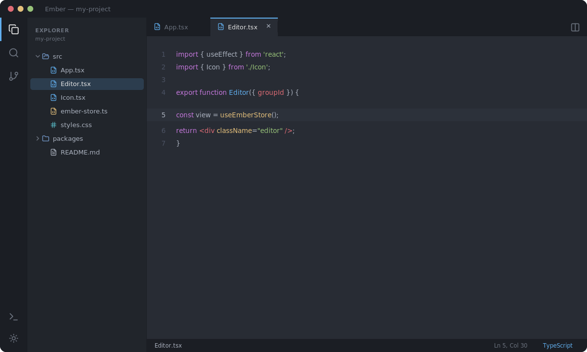

# Ember IDE

A lightweight, local-first code editor built with **Electron**, **React**, and **CodeMirror 6** — organized as a pnpm monorepo with a strongly-typed IPC layer between the Electron main process and the renderer.

> Desktop-only · local filesystem · no telemetry · no cloud.



## Features

- **Editor** — CodeMirror 6 with syntax highlighting for JS/TS/JSX/TSX, JSON, CSS/SCSS, HTML, Markdown and Python, plus autocomplete, bracket matching, code folding, and find & replace (`Ctrl+F` / `Ctrl+H`).
- **File explorer** — tree view with create / rename / delete, a right-click context menu, and per-file-type icons.
- **Project search** — fast recursive text search across the workspace (`Ctrl+Shift+F`) with case-sensitive and regex options.
- **Source control** — a built-in Git panel: branch, staged/unstaged changes, inline diffs, stage/unstage, and commit.
- **Integrated terminal** — a shell panel at the bottom (`Ctrl+` `` ` ``).
- **Command palette** — fuzzy-searchable commands (`Ctrl+Shift+P`).
- **Split editors** — open two editor groups side by side.
- **Theming** — dark (One Dark) and light themes with a one-click toggle; the editor and chrome switch together.
- **External-change detection** — files edited outside the IDE auto-reload when clean and prompt on conflict.

## Architecture

Canonical text, undo/redo, and all disk writes live in the Electron **main** process. The renderer is a thin view that talks to main over a Zod-validated IPC bridge exposed on `window.ember`.

```
apps/
  ember-electron/
    main/        Electron main process — IPC, menus, watcher, terminal, git
    renderer/    Vite + React UI — CodeMirror editor, Zustand store
packages/
  ipc-schema/      Zod schemas — single source of truth for IPC shapes
  vfs/             Virtual filesystem — atomic writes + chokidar watcher
  document-store/  Canonical document model + undo/redo
```

**Key invariants:** the renderer never mutates canonical buffers directly — it goes through RPCs to the `DocumentStore`; the VFS is the only writer to disk; ETags (`mtime:<ms>|size:<bytes>`) detect write races.

## Getting started

Requires Node ≥ 18 and [pnpm](https://pnpm.io).

```bash
pnpm install        # install dependencies (once)
pnpm build          # compile shared packages + main + renderer
pnpm dev            # run the Vite renderer and Electron together
```

Open a folder from the **Explorer** header (or **File → Change Directory…**, `Ctrl+Shift+O`).

Run the two processes separately if you prefer clearer logs:

```bash
pnpm dev:renderer   # Vite on http://127.0.0.1:5173
pnpm dev:main       # Electron (waits for Vite)
```

## Keyboard shortcuts

| Action | Shortcut |
| --- | --- |
| Command palette | `Ctrl+Shift+P` |
| Project search | `Ctrl+Shift+F` |
| Find / Replace in file | `Ctrl+F` / `Ctrl+H` |
| Go to line | `Ctrl+G` |
| Save | `Ctrl+S` |
| Toggle terminal | `Ctrl+` `` ` `` |
| Open folder | `Ctrl+Shift+O` |

## Tech stack

pnpm workspaces · TypeScript (strict) · Electron · Vite · React · Zustand · CodeMirror 6 · Zod · chokidar · simple-git · xterm.js

## License

MIT
